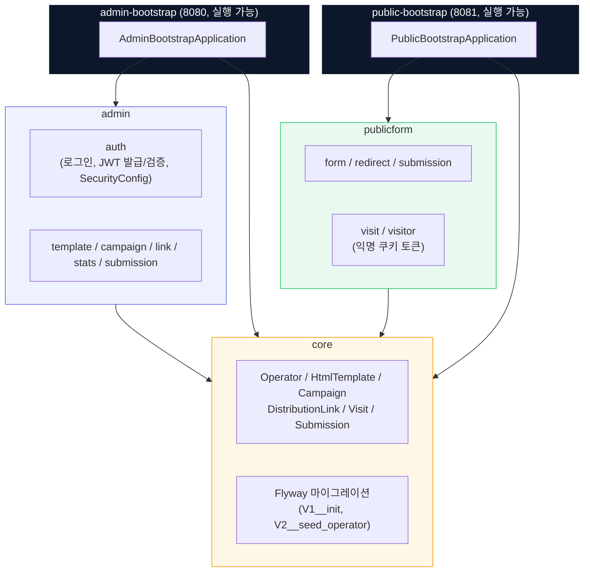
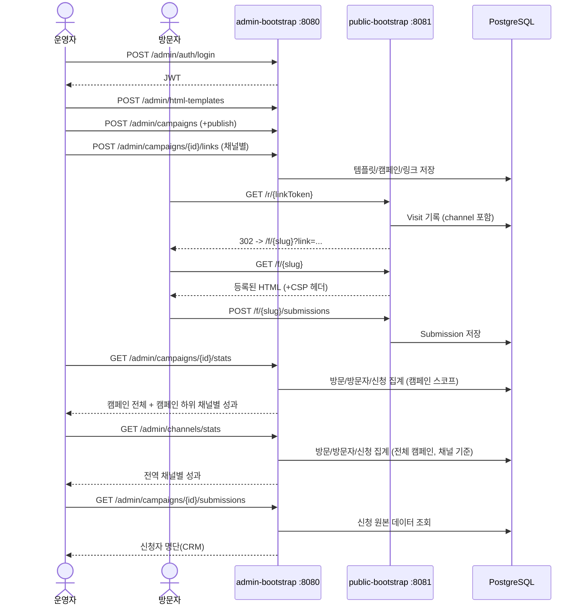

# 아키텍처 개요

5개 Gradle 모듈의 의존 방향과, 이 프로젝트의 핵심 설계 포인트인 "운영자(admin)와
방문자(publicform)는 서로를 전혀 모른다"는 신뢰 경계를 함께 표시했다. 근거는
`docs/adr/0008-module-structure-trust-boundary.md`,
`docs/adr/0011-jwt-auth-with-process-isolation.md` 참고.

## 읽는 법

- **실선 화살표**: `build.gradle`의 `implementation project(':X')`로 명시된, 컴파일 타임에
  강제되는 모듈 의존. `core`는 모든 모듈이 의존할 수 있는 공유 도메인(shared kernel)이다.
- **`admin`과 `publicform` 사이엔 화살표가 없다** — 이게 이 프로젝트에서 가장 중요한 경계다.
  어느 쪽 코드에서도 반대쪽 클래스를 import할 방법이 없어, "등록된 HTML이 관리자 인증정보나
  관리자 API에 접근하지 못하게 해야 한다"는 비기능 요구사항을 빌드 단계에서부터 물리적으로
  강제한다.
- `admin-bootstrap`(8080)과 `public-bootstrap`(8081)은 같은 저장소의 서로 다른 실행
  가능 산출물이다. 실제 운영에서도 별도 프로세스/포트로 뜨며, 방문자의 브라우저는 8081하고만
  통신하므로 admin의 JWT를 획득할 방법이 없다.

## 요청 흐름

세부 API 스펙은 `docs/api.md`, 각 설계 결정의 근거는 `docs/adr/`를 참고한다.
